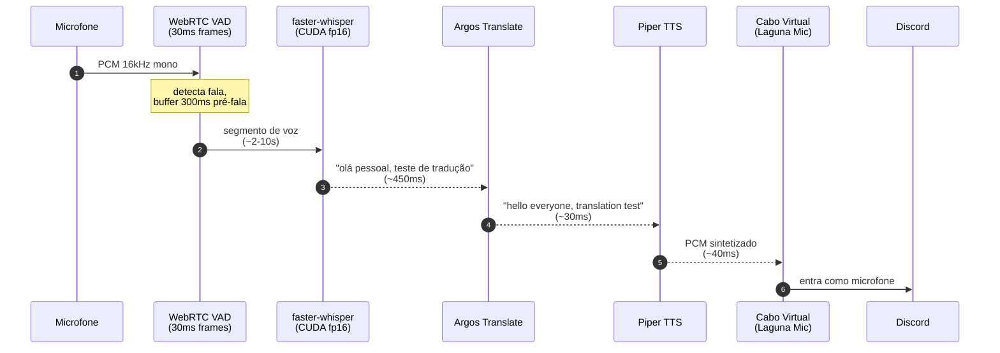
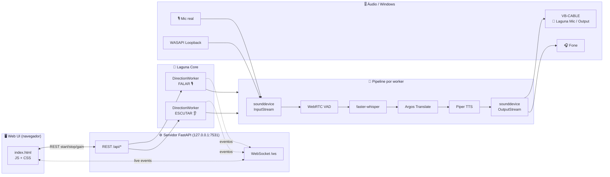
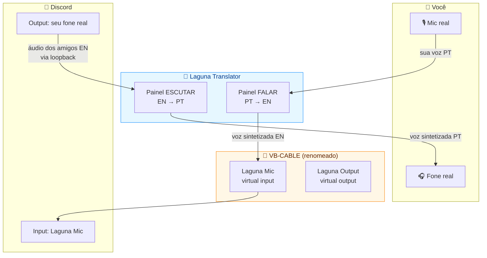
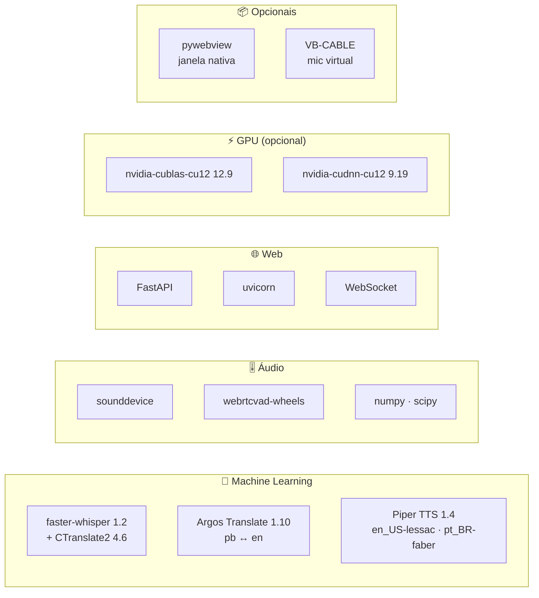
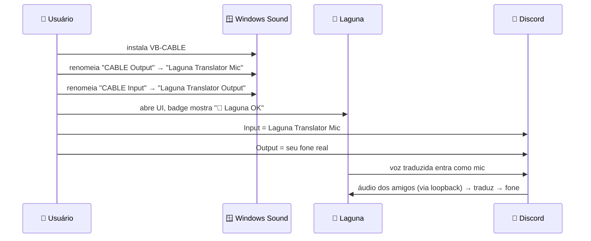

<div align="center">

# 🌊 Laguna Translator

### Tradução de voz em tempo real · **100% local** · PT ↔ EN · feito pra Discord

_Fale português — seus amigos ouvem em inglês.<br/>Eles falam em inglês — você ouve em português._<br/>
_Sem nuvem. Sem API key. Sem latência de internet. Sua voz nunca sai da sua máquina._

<br/>


**p50 ~450ms · p95 ~550ms** _(GPU small, fala → tradução sintetizada)_

</div>

🇧🇷 [**Português**](#-português) · 🇺🇸 [**English**](#-english)

---

## 🇧🇷 Português
<a name="-português"></a>

## ✨ O que é

**Laguna** é um tradutor de voz em tempo real pensado pra chamadas no Discord (mas serve pra qualquer coisa). Você fala no microfone, o Laguna transcreve, traduz e ressintetiza — tudo na sua máquina, em menos de meio segundo — e entrega o áudio traduzido num microfone virtual que o Discord enxerga como se fosse seu.

O caminho contrário também funciona: captura o áudio do Discord, transcreve e traduz pra você ouvir no fone.

> **Não-metas**: isto não é um produto SaaS, não é um competidor de Google Translate, e não tenta ser. É uma ferramenta pra quem joga/conversa com gente que fala outro idioma e quer uma ponte sem depender de cloud.

---

## 🎬 Veja em ação (fluxo FALAR)



---

## 🧭 Arquitetura



Dois workers rodam **simultâneos e independentes** — cada um com seus modelos, configs, devices e métricas. O servidor FastAPI só orquestra: REST pra controle, WebSocket pra live updates (STT parcial, tradução, latência rolling, medidores de nível).

---

## 🧩 Como os dois painéis se encaixam



---

## 🚀 Destaques

| | |
|---|---|
| 🔒 **100% local** | Nenhum dado sai da máquina. Sem API key, sem cloud, sem telemetria. |
| ⚡ **p50 ~450ms** | Small + CUDA fp16 é o sweet spot — rápido _e_ preciso. |
| 🔁 **Bidirecional simultâneo** | Dois pipelines independentes: FALAR e ESCUTAR rodam ao mesmo tempo. |
| 🌐 **Detecção de idioma** | Se você já falou no idioma alvo, pula a tradução (~130ms overhead, zero latência extra de MT/TTS). |
| 🎚️ **Passthrough opcional** | Mandar _também_ sua voz original junto com a tradução (útil pra mixar canal bilíngue). |
| 🎛️ **UI web reativa** | WebSocket + medidores de nível + latência p50/p95 em tempo real. |
| 🌗 **Temas claro/escuro** | Shift+T pra alternar. |
| 🌎 **i18n PT/EN** | Toggle 🌐 no topo. |
| 🎧 **WASAPI loopback** | Captura saída do PC direto (sem "Stereo Mix"). |
| 🪶 **Lean** | Sem torch. Dependências bem definidas em `requirements.txt`. |

---

## 📊 Performance medida

Frase teste: _"Hello everyone, this is a real-time translator test for Discord."_ (sintetizada via Piper pt_BR, ~4s de áudio).

| Stack | STT | MT | TTS | **Total** | Qualidade |
|---|---:|---:|---:|---:|---|
| tiny CPU int8 | 410 ms | 317 ms | 272 ms | **999 ms** | ❌ baixa (muitos erros) |
| small CPU int8 | 2179 ms | 292 ms | 296 ms | **2767 ms** | ✅ perfeita |
| **small CUDA fp16** ⭐ | **568 ms** | **269 ms** | **276 ms** | **1113 ms** | ✅ **perfeita** |
| medium CUDA fp16 | 775 ms | 317 ms | 246 ms | 1338 ms | ⚠ leve hallucination |

### Stress (200 segmentos contínuos, GPU small)

| Direção | p50 | p95 | p99 |
|---|---:|---:|---:|
| PT → EN (pb→en) | **458 ms** | 562 ms | 600 ms |
| EN → PT (en→pb) | **424 ms** | 496 ms | 534 ms |

> _"Medium ficou com `'tradutora'` e traduziu `'Discord'` → `'discórdia'`; small acertou tudo."_ Small é o ponto ótimo: mais rápido **e** mais preciso pro caso de uso.

---

## ⚙️ Stack técnica



---

## 🏃 Quick start

### Pré-requisitos
- **Windows 10/11** (o launcher `.vbs`/`.bat` e WASAPI loopback são Windows-específicos)
- **Python 3.13** em `C:\Python313\` _(ou ajuste os caminhos nos scripts)_
- **GPU NVIDIA** com CUDA 12 _(opcional, mas fortemente recomendado — roda em CPU também)_
- **VB-CABLE** pra integrar com Discord: https://vb-audio.com/Cable/

### Instalar

```bash
git clone https://github.com/caioross/Laguna_Translate.git
cd Laguna_Translate
C:/Python313/python.exe -m pip install -r requirements.txt

# Para GPU (opcional — skip se só for rodar em CPU)
C:/Python313/python.exe -m pip install nvidia-cublas-cu12 nvidia-cudnn-cu12

# Para launcher .exe-like com janela nativa (opcional)
C:/Python313/python.exe -m pip install pywebview fastapi uvicorn
```

Modelos baixam sozinhos no primeiro run (~800MB total): Whisper small, vozes Piper, pacotes Argos pb↔en.

### Rodar a UI web

```bash
C:/Python313/python.exe laguna_server.py
```

Abre `http://127.0.0.1:7531` automaticamente. Dois painéis — **FALAR** e **ESCUTAR** — com tudo configurável e métricas ao vivo.

### Rodar com janela nativa (WebView2)

```bash
C:/Python313/python.exe laguna_app.py
```

### Atalhos no Desktop + Menu Iniciar

```powershell
powershell -ExecutionPolicy Bypass -File .\install_shortcuts.ps1
```

Cria `Laguna Translator.lnk` no Desktop e Menu Iniciar. Usa `Laguna.vbs` (launcher silencioso, sem console). Pra remover: `uninstall_shortcuts.ps1`.

### Modo CLI (sem UI, útil pra debug)

```bash
# Listar devices
C:/Python313/python.exe fase0_poc.py --list-devices

# PT → EN
C:/Python313/python.exe fase0_poc.py --direction pt2en --model small --device cuda

# EN → PT
C:/Python313/python.exe fase0_poc.py --direction en2pt --model small --device cuda

# Debug (salva WAVs dos segmentos)
C:/Python313/python.exe fase0_poc.py --direction pt2en --debug
```

`Ctrl+C` encerra e imprime estatísticas p50/p95/p99 por estágio.

### Teste offline (sem microfone)

```bash
C:/Python313/python.exe test_offline.py dry_en2pt.wav --direction pt2en --model small --device cuda -o out.wav
```

### Stress tests

```bash
C:/Python313/python.exe stress_fase0.py --rounds 20 --model small --device cuda   # PT → EN
C:/Python313/python.exe stress_en2pt.py --rounds 20 --model small --device cuda   # EN → PT
```

---

## 💬 Configurar Discord (VB-CABLE + renomear)



1. Baixe e instale **VB-CABLE**: https://vb-audio.com/Cable/ _(grátis, reinicie depois)_
2. **Configurações de som do Windows → Mais opções de som**
3. Aba **Gravação** → direito em `CABLE Output` → **Propriedades → Geral** → renomeia pra `Laguna Translator Mic`
4. Aba **Reprodução** → direito em `CABLE Input` → **Propriedades → Geral** → renomeia pra `Laguna Translator Output`
5. No Laguna a badge do topo vira **"🌊 Laguna: dispositivos renomeados OK"**
6. No Discord → **Voz e Vídeo**:
   - **Entrada:** `Laguna Translator Mic`
   - **Saída:** seu fone real (não o virtual)
7. No painel do Laguna:
   - **FALAR → "Saída virtual"** = `Laguna Translator Output`
   - **ESCUTAR → "Captura"** = `Laguna Translator Mic` _(ou marque loopback e selecione o device que o Discord usa)_

Sem VB-CABLE o app ainda funciona — só não aparece "invisível" como mic no Discord.

---

## 📁 Estrutura do projeto

```
Laguna_Translate/
├── laguna_core.py          # DirectionWorker: pipeline bidirecional, VAD/STT/MT/TTS
├── laguna_server.py        # FastAPI + WebSocket (UI web em http://127.0.0.1:7531)
├── laguna_app.py           # Launcher com janela nativa (pywebview + WebView2)
├── fase0_poc.py            # CLI + classes base (STT, ArgosMT, PiperTTS, VAD)
├── fase1_app.py            # Painel PySide6 (legado, substituído pela UI web)
│
├── static/                 # UI web
│   ├── index.html
│   ├── app.js              # controla REST/WS, 2 painéis, medidores, temas
│   ├── i18n.js             # PT/EN
│   └── style.css
│
├── Laguna.vbs              # launcher silencioso (pythonw, sem console)
├── Laguna.bat              # launcher com console (debug)
├── install_shortcuts.ps1   # cria atalhos Desktop + Start Menu
├── uninstall_shortcuts.ps1
│
├── bench_fase0.py          # benchmark single-frase comparando stacks
├── stress_fase0.py         # stress PT → EN (200+ segmentos)
├── stress_en2pt.py         # stress EN → PT
├── test_offline.py         # pipeline num WAV (sem mic)
├── test_lang_detect.py     # testa skip-same-lang
│
├── requirements.txt
├── LICENSE                 # MIT
└── README.md               # você tá aqui
```

---

## 🎛 UI: o que cada painel faz

**FALAR** — você fala no mic real, Laguna traduz, áudio sintetizado sai no microfone virtual que o Discord usa como entrada.

**ESCUTAR** — Laguna captura o áudio que chega ao seu fone (via loopback WASAPI ou um mic virtual pareado), traduz e toca no seu fone.

Cada painel tem:
- seleção de idiomas (origem → alvo)
- seleção de devices (mic/loopback, saída virtual, fone opcional)
- toggle **passthrough** (enviar também o áudio original)
- controles de volume (saída da tradução, passthrough) em dB
- avançado: modelo STT, device (auto/cuda/cpu), **skip same lang**
- bloco ao vivo: transcrição + tradução + métricas p50/p95 + medidores de nível
- tooltips em tudo (passe o mouse)

---

## 🗺 Roadmap / ideias

- [ ] **Empacotar como `.exe` standalone** (PyInstaller `--onedir` com hooks pra `faster_whisper`, `piper`, `ctranslate2`, `nvidia.cublas`, `nvidia.cudnn`, `argostranslate` → Inno Setup wrapper). Instalador ~1.5GB full, ~300MB com first-run bootstrap.
- [ ] Backend alternativo de MT (NLLB, M2M100) pra melhorar gíria de jogo (_"sick flick"_, _"carry"_).
- [ ] Mais pares de idiomas (ES, FR, JP...).
- [ ] Modelo Whisper `distil-large-v3` como opção premium.
- [ ] Push-to-talk opcional.
- [ ] Build Linux (loopback via PulseAudio/PipeWire em vez de WASAPI).

---

## 🛠 Notas técnicas

### Argos: `pt` vs `pb`

Argos tem **dois** pacotes portugueses:
- `pt` → Europeu ("estás", "equipa", "juntar-se")
- `pb` → Brasileiro ("está", "time", "se juntar")

O código mapeia `pt → pb` automaticamente via `ARGOS_CODE_MAP` em [fase0_poc.py](fase0_poc.py). **Whisper STT** continua usando `pt` (o modelo não distingue variantes).

### DLLs CUDA no Windows

`fase0_poc.py::_register_cuda_dlls()` procura `nvidia.cublas` e `nvidia.cudnn` instalados via pip e registra os diretórios `bin/` antes do `import faster_whisper`. Sem isso, `ctranslate2` não encontra as DLLs no Windows.

### Pipeline de VAD → segmentação

`WebRTC VAD` com agressividade 2, frames de 30ms. Buffer pré-fala de 300ms, hangover de silêncio de 600ms, segmento mínimo 400ms, máximo 12s (force flush). Implementação em [laguna_core.py](laguna_core.py) e [fase0_poc.py](fase0_poc.py).

---

## 🤝 Contribuindo

Este projeto é **open-source de verdade** — no sentido "faz fork e se divirta". Não tem roadmap oficial, não tem SLA, não tem processo. Se você acha que falta algo:

1. Dá **fork**.
2. Mexe à vontade.
3. Se achar que vale compartilhar, manda um **PR** descrevendo o que mudou e por quê.
4. Se quiser seguir um caminho totalmente diferente, siga — o fork é seu.

Issues com bugs/ideias também são bem-vindas. Sem PR template, sem CLA, sem burocracia. Respeito mútuo e só.

---

## 📜 Licença

**MIT** — ver [LICENSE](LICENSE). Faz o que quiser: comercial, pessoal, fork, remix, rebrand. Só não tire o copyright e não me processe se quebrar. 🤝

---

## 🇺🇸 English
<a name="-english"></a>

### What it is

**Laguna** is a real-time voice translator built for Discord calls (but works anywhere). You speak into your mic; Laguna transcribes, translates and re-synthesizes it — all on your machine, in under half a second — and feeds the translated audio into a virtual microphone that Discord sees as if it were you. The reverse direction works too: it captures Discord's audio, transcribes and translates it back for you to hear.

> **Non-goals:** this is not a SaaS product, not a Google Translate competitor, and doesn't try to be. It's a tool for people who game/chat with someone speaking another language and want a bridge that doesn't depend on the cloud.

### Highlights

- 🔒 **100% local** — nothing leaves your machine. No API key, no cloud, no telemetry.
- ⚡ **p50 ~450 ms** — `small` + CUDA fp16 is the sweet spot: fast *and* accurate.
- 🔁 **Bidirectional & simultaneous** — two independent pipelines (SPEAK / LISTEN) run at once.
- 🌐 **Language detection** — if you already spoke the target language, it skips translation.
- 🎚️ **Optional passthrough**, 🎛️ **reactive web UI** (WebSocket level meters + live p50/p95 latency), 🌗 light/dark themes, 🌎 PT/EN i18n, 🎧 WASAPI loopback, 🪶 lean deps (no torch).

### Stack

faster-whisper 1.2 (+ CTranslate2) · Argos Translate (pb ↔ en) · Piper TTS · sounddevice + WebRTC VAD + numpy/scipy · FastAPI + uvicorn + WebSocket · optional NVIDIA CUDA 12 + pywebview + VB-CABLE.

### Quick start

```bash
git clone https://github.com/caioross/Laguna_Translate.git
cd Laguna_Translate
C:/Python313/python.exe -m pip install -r requirements.txt
C:/Python313/python.exe laguna_server.py   # opens http://127.0.0.1:7531
```

Models auto-download on first run (~800 MB). Two panels — **SPEAK** (PT→EN) and **LISTEN** (EN→PT) — with everything configurable and live metrics. For Discord, install **VB-CABLE** and point Discord's input at the renamed virtual device. CLI/offline/stress modes are available (`fase0_poc.py`, `test_offline.py`, `stress_*.py`).

> The full setup, performance tables, Discord wiring, architecture diagrams and technical notes are documented in detail in the Portuguese section above — the code, UI and config are themselves bilingual (PT/EN).

---

## 📜 License

**MIT** — see [LICENSE](LICENSE). Do whatever you want: commercial, personal, fork, remix, rebrand. Just keep the copyright and don't sue me if it breaks. 🤝

---

<div align="center">

_Construído com ☕ e muita fé no `faster-whisper`._

*Parte do ecossistema de projetos de **Caio**.*

</div>