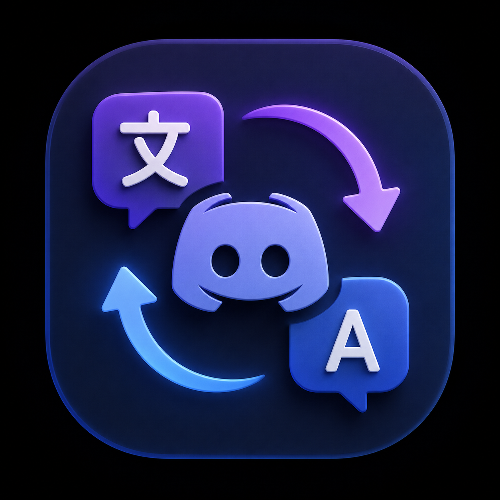
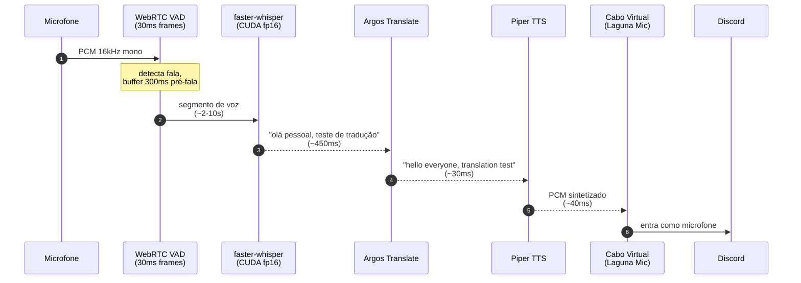
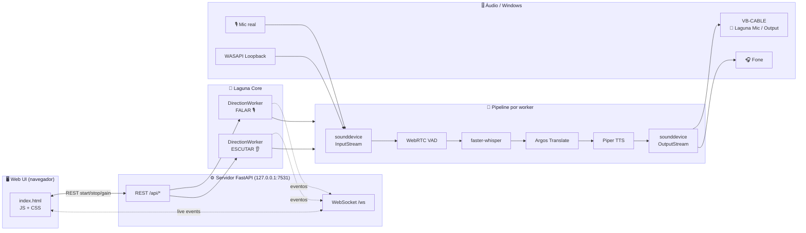
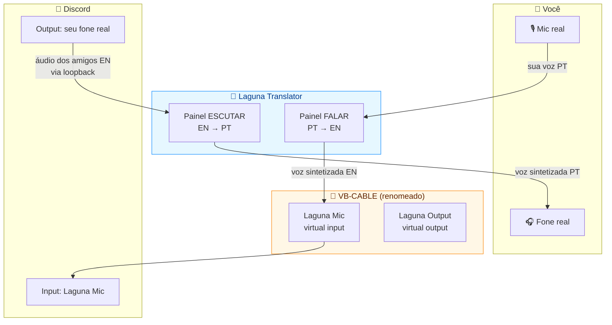
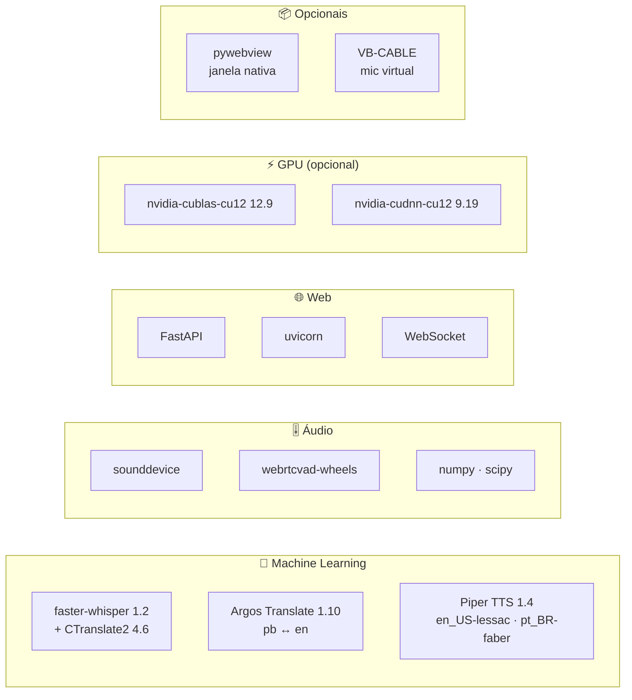
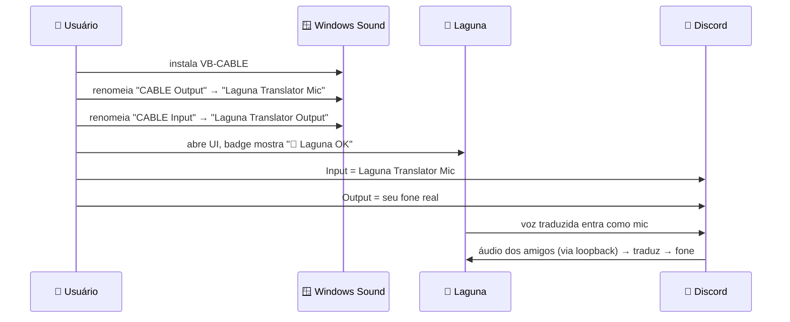
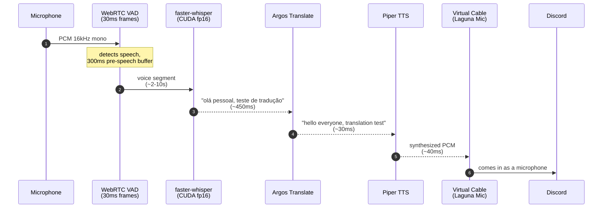
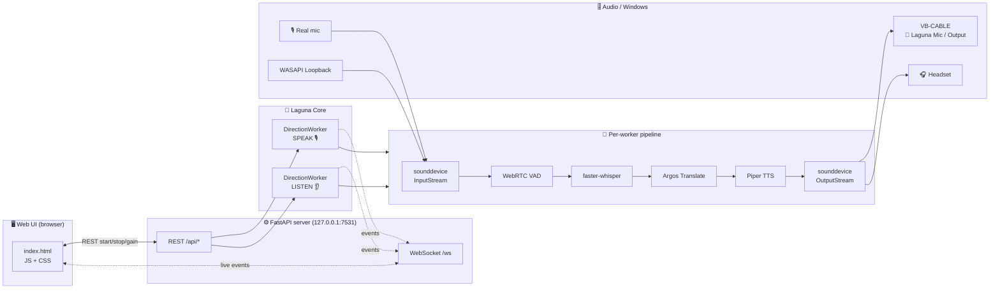
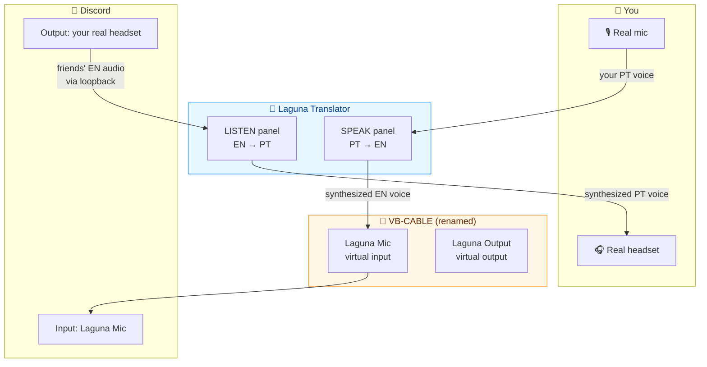

<div align="center">


# 🌊 Laguna Translator

### Tradução de voz em tempo real · **100% local** · PT ↔ EN · feito pra Discord

_Fale português — seus amigos ouvem em inglês.<br/>Eles falam em inglês — você ouve em português._<br/>
_Sem nuvem. Sem API key. Sem latência de internet. Sua voz nunca sai da sua máquina._

<br/>

[](https://lagunatranslate.vercel.app/)
[](https://github.com/caioross/Laguna_Translate)


[](https://github.com/caioross/Laguna_Translate/stargazers)


**p50 ~450ms · p95 ~550ms** _(GPU small, fala → tradução sintetizada)_

</div>

<p align="center">
  <a href="https://lagunatranslate.vercel.app/"><b>🌐 Site</b></a> ·
  🇧🇷 <a href="#-português"><b>Português</b></a> ·
  🇺🇸 <a href="#-english"><b>English</b></a>
</p>

---

<a id="-português"></a>
## 🇧🇷 Português

<table>
<tr><td>

**Índice** — &nbsp;
[O que é](#pt-o-que-e) ·
[Em ação](#pt-acao) ·
[Arquitetura](#pt-arquitetura) ·
[Os dois painéis](#pt-paineis) ·
[Destaques](#pt-destaques) ·
[Comparativo](#pt-comparativo) ·
[Performance](#pt-performance) ·
[Stack](#pt-stack) ·
[Quick start](#pt-quickstart) ·
[Discord](#pt-discord) ·
[Estrutura](#pt-estrutura) ·
[UI](#pt-ui) ·
[Problemas](#pt-problemas) ·
[FAQ](#pt-faq) ·
[Roadmap](#pt-roadmap) ·
[Notas técnicas](#pt-notas) ·
[Contribuindo](#pt-contrib) ·
[Licença](#pt-licenca)

</td></tr>
</table>

<a id="pt-o-que-e"></a>
## ✨ O que é

**Laguna** é um tradutor de voz em tempo real pensado pra chamadas no Discord (mas serve pra qualquer coisa). Você fala no microfone, o Laguna transcreve, traduz e ressintetiza — tudo na sua máquina, em menos de meio segundo — e entrega o áudio traduzido num microfone virtual que o Discord enxerga como se fosse seu.

O caminho contrário também funciona: captura o áudio do Discord, transcreve e traduz pra você ouvir no fone.

> **Não-metas**: isto não é um produto SaaS, não é um competidor de Google Translate, e não tenta ser. É uma ferramenta pra quem joga/conversa com gente que fala outro idioma e quer uma ponte sem depender de cloud.

> 🌐 **Tem um site de apresentação:** **[lagunatranslate.vercel.app](https://lagunatranslate.vercel.app/)** — bilíngue, com o pipeline animado e a UI em destaque.

---

<a id="pt-acao"></a>
## 🎬 Veja em ação (fluxo FALAR)



---

<a id="pt-arquitetura"></a>
## 🧭 Arquitetura



Dois workers rodam **simultâneos e independentes** — cada um com seus modelos, configs, devices e métricas. O servidor FastAPI só orquestra: REST pra controle, WebSocket pra live updates (STT parcial, tradução, latência rolling, medidores de nível).

---

<a id="pt-paineis"></a>
## 🧩 Como os dois painéis se encaixam



---

<a id="pt-destaques"></a>
## 🚀 Destaques

| | |
|---|---|
| 🔒 **100% local** | Nenhum dado sai da máquina. Sem API key, sem cloud, sem telemetria. |
| ⚡ **p50 ~450ms** | Small + CUDA fp16 é o sweet spot — rápido _e_ preciso. |
| 🔁 **Bidirecional simultâneo** | Dois pipelines independentes: FALAR e ESCUTAR rodam ao mesmo tempo. |
| 🌐 **Detecção de idioma** | Se você já falou no idioma alvo, pula a tradução (~130ms overhead, zero latência extra de MT/TTS). |
| 🎚️ **Passthrough opcional** | Mandar _também_ sua voz original junto com a tradução (útil pra mixar canal bilíngue). |
| 🎛️ **UI web reativa** | WebSocket + medidores de nível + latência p50/p95 em tempo real. |
| 🌗 **Temas claro/escuro** | Shift+T pra alternar. |
| 🌎 **i18n PT/EN** | Toggle 🌐 no topo. |
| 🎧 **WASAPI loopback** | Captura saída do PC direto (sem "Stereo Mix"). |
| 🪶 **Lean** | Sem torch. Dependências bem definidas em `requirements.txt`. |

---

<a id="pt-comparativo"></a>
## ⚖️ Como se compara

|  | 🌊 **Laguna** | ☁️ Bots / SaaS de cloud | 📱 Google Translate (app) | 🤖 Bots de tradução do Discord |
|---|:---:|:---:|:---:|:---:|
| Roda 100% local | ✅ | ❌ | ❌ | ❌ |
| Entra como microfone no Discord | ✅ | ⚠️ varia | ❌ | ❌ (precisa de bot no servidor) |
| Latência típica | **~450ms** | 2–5s | — (é uma tela) | 1–3s+ |
| Privacidade da voz | total | ❌ | ❌ | ❌ |
| Bidirecional simultâneo | ✅ | ⚠️ | ❌ | ⚠️ |
| Sem API key / sem conta | ✅ | ❌ | ✅ | ⚠️ |
| Custo | grátis · MIT | $/mês | grátis | grátis/$ |

> Honestidade: serviços de cloud podem ter tradução de qualidade superior em frases longas. A Laguna troca um pouco disso por **latência baixa, privacidade total e zero dependência de internet** — que é o que faz uma conversa fluir.

---

<a id="pt-performance"></a>
## 📊 Performance medida

Frase teste: _"Hello everyone, this is a real-time translator test for Discord."_ (sintetizada via Piper pt_BR, ~4s de áudio).

| Stack | STT | MT | TTS | **Total** | Qualidade |
|---|---:|---:|---:|---:|---|
| tiny CPU int8 | 410 ms | 317 ms | 272 ms | **999 ms** | ❌ baixa (muitos erros) |
| small CPU int8 | 2179 ms | 292 ms | 296 ms | **2767 ms** | ✅ perfeita |
| **small CUDA fp16** ⭐ | **568 ms** | **269 ms** | **276 ms** | **1113 ms** | ✅ **perfeita** |
| medium CUDA fp16 | 775 ms | 317 ms | 246 ms | 1338 ms | ⚠ leve hallucination |

### Stress (200 segmentos contínuos, GPU small)

| Direção | p50 | p95 | p99 |
|---|---:|---:|---:|
| PT → EN (pb→en) | **458 ms** | 562 ms | 600 ms |
| EN → PT (en→pb) | **424 ms** | 496 ms | 534 ms |

> _"Medium ficou com `'tradutora'` e traduziu `'Discord'` → `'discórdia'`; small acertou tudo."_ Small é o ponto ótimo: mais rápido **e** mais preciso pro caso de uso.

---

<a id="pt-stack"></a>
## ⚙️ Stack técnica



---

<a id="pt-quickstart"></a>
## 🏃 Quick start

### Pré-requisitos
- **Windows 10/11** (o launcher `.vbs`/`.bat` e WASAPI loopback são Windows-específicos)
- **Python 3.13** em `C:\Python313\` _(ou ajuste os caminhos nos scripts)_
- **GPU NVIDIA** com CUDA 12 _(opcional, mas fortemente recomendado — roda em CPU também)_
- **VB-CABLE** pra integrar com Discord: https://vb-audio.com/Cable/

### Instalar

```bash
git clone https://github.com/caioross/Laguna_Translate.git
cd Laguna_Translate
C:/Python313/python.exe -m pip install -r requirements.txt

# Para GPU (opcional — skip se só for rodar em CPU)
C:/Python313/python.exe -m pip install nvidia-cublas-cu12 nvidia-cudnn-cu12

# Para launcher .exe-like com janela nativa (opcional)
C:/Python313/python.exe -m pip install pywebview fastapi uvicorn
```

> Para uma instalação **reproduzível** com as versões exatas comprovadas, use o `requirements.lock` no lugar do `requirements.txt`: `C:/Python313/python.exe -m pip install -r requirements.lock`.

Modelos baixam sozinhos no primeiro run (~800MB total): Whisper small, vozes Piper, pacotes Argos pb↔en.

### Rodar a UI web

```bash
C:/Python313/python.exe laguna_server.py
```

Abre `http://127.0.0.1:7531` automaticamente. Dois painéis — **FALAR** e **ESCUTAR** — com tudo configurável e métricas ao vivo.

### Rodar com janela nativa (WebView2)

```bash
C:/Python313/python.exe laguna_app.py
```

### Atalhos no Desktop + Menu Iniciar

```powershell
powershell -ExecutionPolicy Bypass -File .\install_shortcuts.ps1
```

Cria `Laguna Translator.lnk` no Desktop e Menu Iniciar. Usa `Laguna.vbs` (launcher silencioso, sem console). Pra remover: `uninstall_shortcuts.ps1`.

<details>
<summary><b>Modos CLI, offline e stress tests</b> (clique pra expandir)</summary>

### Modo CLI (sem UI, útil pra debug)

```bash
# Listar devices
C:/Python313/python.exe fase0_poc.py --list-devices

# PT → EN
C:/Python313/python.exe fase0_poc.py --direction pt2en --model small --device cuda

# EN → PT
C:/Python313/python.exe fase0_poc.py --direction en2pt --model small --device cuda

# Debug (salva WAVs dos segmentos)
C:/Python313/python.exe fase0_poc.py --direction pt2en --debug
```

`Ctrl+C` encerra e imprime estatísticas p50/p95/p99 por estágio.

### Teste offline (sem microfone)

```bash
C:/Python313/python.exe test_offline.py dry_en2pt.wav --direction pt2en --model small --device cuda -o out.wav
```

### Stress tests

```bash
C:/Python313/python.exe stress_fase0.py --rounds 20 --model small --device cuda   # PT → EN
C:/Python313/python.exe stress_en2pt.py --rounds 20 --model small --device cuda   # EN → PT
```

</details>

---

<a id="pt-discord"></a>
## 💬 Configurar Discord (VB-CABLE + renomear)



<details open>
<summary><b>Passo a passo</b></summary>

1. Baixe e instale **VB-CABLE**: https://vb-audio.com/Cable/ _(grátis, reinicie depois)_
2. **Configurações de som do Windows → Mais opções de som**
3. Aba **Gravação** → direito em `CABLE Output` → **Propriedades → Geral** → renomeia pra `Laguna Translator Mic`
4. Aba **Reprodução** → direito em `CABLE Input` → **Propriedades → Geral** → renomeia pra `Laguna Translator Output`
5. No Laguna a badge do topo vira **"🌊 Laguna: dispositivos renomeados OK"**
6. No Discord → **Voz e Vídeo**:
   - **Entrada:** `Laguna Translator Mic`
   - **Saída:** seu fone real (não o virtual)
7. No painel do Laguna:
   - **FALAR → "Saída virtual"** = `Laguna Translator Output`
   - **ESCUTAR → "Captura"** = `Laguna Translator Mic` _(ou marque loopback e selecione o device que o Discord usa)_

</details>

Sem VB-CABLE o app ainda funciona — só não aparece "invisível" como mic no Discord.

---

<a id="pt-estrutura"></a>
## 📁 Estrutura do projeto

<details>
<summary><b>Árvore de arquivos</b></summary>

```
Laguna_Translate/
├── laguna_core.py          # DirectionWorker: pipeline bidirecional, VAD/STT/MT/TTS
├── laguna_server.py        # FastAPI + WebSocket (UI web em http://127.0.0.1:7531)
├── laguna_app.py           # Launcher com janela nativa (pywebview + WebView2)
├── laguna_pipeline.py      # Engines e constantes: STT, ArgosMT, PiperTTS, VAD, detect_device
├── fase0_poc.py            # CLI de POC (--list-devices); reexporta laguna_pipeline por compat
├── fase1_app.py            # Painel PySide6 (legado, substituído pela UI web)
│
├── static/                 # UI web
│   ├── index.html
│   ├── app.js              # controla REST/WS, 2 painéis, medidores, temas
│   ├── i18n.js             # PT/EN
│   └── style.css
│
├── Laguna.vbs              # launcher silencioso (pythonw, sem console)
├── Laguna.bat              # launcher com console (debug)
├── install_shortcuts.ps1   # cria atalhos Desktop + Start Menu
├── uninstall_shortcuts.ps1
│
├── bench_fase0.py          # benchmark single-frase comparando stacks
├── stress_fase0.py         # stress PT → EN (200+ segmentos)
├── stress_en2pt.py         # stress EN → PT
├── test_offline.py         # pipeline num WAV (sem mic)
├── test_lang_detect.py     # testa skip-same-lang
│
├── docs/                   # plano técnico
├── requirements.txt
├── LICENSE                 # MIT
└── README.md               # você tá aqui
```

> O **site de apresentação** ([lagunatranslate.vercel.app](https://lagunatranslate.vercel.app/)) mora num **repositório separado** ([LagunaTranslate-site](https://github.com/caioross/LagunaTranslate-site)) — Next.js + Tailwind.

</details>

---

<a id="pt-ui"></a>
## 🎛 UI: o que cada painel faz

**FALAR** — você fala no mic real, Laguna traduz, áudio sintetizado sai no microfone virtual que o Discord usa como entrada.

**ESCUTAR** — Laguna captura o áudio que chega ao seu fone (via loopback WASAPI ou um mic virtual pareado), traduz e toca no seu fone.

Cada painel tem:
- seleção de idiomas (origem → alvo)
- seleção de devices (mic/loopback, saída virtual, fone opcional)
- toggle **passthrough** (enviar também o áudio original)
- controles de volume (saída da tradução, passthrough) em dB
- avançado: modelo STT, device (auto/cuda/cpu), **skip same lang**
- bloco ao vivo: transcrição + tradução + métricas p50/p95 + medidores de nível
- tooltips em tudo (passe o mouse)

---

<a id="pt-problemas"></a>
## 🧯 Solução de problemas

<details>
<summary><b>CUDA não é detectada / cai pra CPU mesmo com GPU NVIDIA</b></summary>

Instale os pacotes CUDA via pip e confirme que estão no mesmo Python:

```bash
C:/Python313/python.exe -m pip install nvidia-cublas-cu12 nvidia-cudnn-cu12
```

No Windows, `laguna_pipeline.py::_register_cuda_dlls()` registra os diretórios `bin/` do `nvidia.cublas` e `nvidia.cudnn` **antes** do `import faster_whisper`. Sem isso, o `ctranslate2` não acha as DLLs. Force a GPU no painel avançado (**Device → cuda**) pra ver o erro real, se houver.
</details>

<details>
<summary><b>O Discord não escuta a tradução / não aparece o mic virtual</b></summary>

- Confirme que o **VB-CABLE** está instalado e que você reiniciou.
- No painel **FALAR**, a "Saída virtual" precisa ser o `CABLE Input` (renomeado pra `Laguna Translator Output`).
- No **Discord → Voz e Vídeo**, a **Entrada** tem que ser o `CABLE Output` (renomeado pra `Laguna Translator Mic`).
- Recarregue a página da UI depois de renomear — os devices só aparecem marcados com 🌊 após o reload.
</details>

<details>
<summary><b>"loopback indisponível" no painel ESCUTAR</b></summary>

O loopback WASAPI exige um device de **saída** (não de entrada). Marque a opção *"Captura loopback (WASAPI)"* e selecione o dispositivo de **reprodução** que o Discord está usando. Se ainda falhar, use o caminho via VB-CABLE: aponte a saída do Discord pro `Laguna Translator Output` e capture pelo `Laguna Translator Mic`.
</details>

<details>
<summary><b>Os primeiros fonemas são cortados / frases curtas somem</b></summary>

O VAD usa buffer pré-fala de 300ms e segmento mínimo de 400ms. Falas muito curtas ("oi", "ok") podem cair abaixo do mínimo. Fale com um leve "respiro" antes — ou ajuste as constantes em [laguna_pipeline.py](laguna_pipeline.py) (`PRE_SPEECH_BUFFER_MS`, `MIN_SPEECH_MS`).
</details>

<details>
<summary><b>O download dos modelos trava ou está muito lento</b></summary>

Os modelos vêm do Hugging Face Hub no primeiro run e ficam em `models_cache/`. Em picos, o Hub aplica rate-limit. Tente de novo (o download é retomável) ou rode uma direção de cada vez pra baixar menos coisa em paralelo.
</details>

<details>
<summary><b>Eco / loop de feedback (o app escuta a própria tradução)</b></summary>

Garanta que a **saída** da tradução vai pro device virtual (Discord), **não** pro mesmo device que você está capturando. No FALAR, capture do mic real e mande a tradução pro `Laguna Translator Output`. No ESCUTAR, capture do loopback/Discord e toque no seu fone real — nunca no mesmo canal.
</details>

---

<a id="pt-faq"></a>
## ❓ FAQ

**Meu áudio vai pra nuvem?**
Não. Captura, transcrição, tradução e síntese rodam na sua máquina. Sem API key, sem servidor externo, sem telemetria.

**Preciso de GPU NVIDIA?**
Não é obrigatório. Com GPU (CUDA fp16) você fica no sweet spot de ~450ms. Sem GPU, o app cai pro caminho de CPU automaticamente — funciona, só com mais latência.

**Funciona só no Discord?**
Foi pensado pro Discord, mas como entrega a tradução por um microfone virtual, funciona em qualquer app que deixe escolher o device de entrada: Meet, Zoom, OBS, etc.

**Quais idiomas?**
Português ↔ Inglês, nas duas direções e simultaneamente. Outros pares estão no roadmap.

**Preciso do VB-CABLE?**
Só pra entrar "invisível" como mic no Discord. Sem ele o app continua funcionando pra testar e ouvir traduções.

**É de graça? Posso fazer fork?**
Sim. Licença MIT: comercial, pessoal, fork, remix, rebrand. Só mantenha o copyright.

---

<a id="pt-roadmap"></a>
## 🗺 Roadmap / ideias

- [ ] **Empacotar como `.exe` standalone** (PyInstaller `--onedir` com hooks pra `faster_whisper`, `piper`, `ctranslate2`, `nvidia.cublas`, `nvidia.cudnn`, `argostranslate` → Inno Setup wrapper). Instalador ~1.5GB full, ~300MB com first-run bootstrap.
- [ ] Backend alternativo de MT (NLLB, M2M100) pra melhorar gíria de jogo (_"sick flick"_, _"carry"_).
- [ ] Mais pares de idiomas (ES, FR, JP...).
- [ ] Modelo Whisper `distil-large-v3` como opção premium.
- [ ] Push-to-talk opcional.
- [ ] Build Linux (loopback via PulseAudio/PipeWire em vez de WASAPI).

---

<a id="pt-notas"></a>
## 🛠 Notas técnicas

<details>
<summary><b>Argos: <code>pt</code> vs <code>pb</code></b></summary>

Argos tem **dois** pacotes portugueses:
- `pt` → Europeu ("estás", "equipa", "juntar-se")
- `pb` → Brasileiro ("está", "time", "se juntar")

O código mapeia `pt → pb` automaticamente via `ARGOS_CODE_MAP` em [laguna_pipeline.py](laguna_pipeline.py). **Whisper STT** continua usando `pt` (o modelo não distingue variantes).
</details>

<details>
<summary><b>DLLs CUDA no Windows</b></summary>

`laguna_pipeline.py::_register_cuda_dlls()` procura `nvidia.cublas` e `nvidia.cudnn` instalados via pip e registra os diretórios `bin/` antes do `import faster_whisper`. Sem isso, `ctranslate2` não encontra as DLLs no Windows.
</details>

<details>
<summary><b>Pipeline de VAD → segmentação</b></summary>

`WebRTC VAD` com agressividade 2, frames de 30ms. Buffer pré-fala de 300ms, hangover de silêncio de 600ms, segmento mínimo 400ms, máximo 12s (force flush). Implementação em [laguna_core.py](laguna_core.py) e [laguna_pipeline.py](laguna_pipeline.py).
</details>

---

<a id="pt-contrib"></a>
## 🤝 Contribuindo

Este projeto é **open-source de verdade** — no sentido "faz fork e se divirta". Não tem roadmap oficial, não tem SLA, não tem processo. Se você acha que falta algo:

1. Dá **fork**.
2. Mexe à vontade.
3. Se achar que vale compartilhar, manda um **PR** descrevendo o que mudou e por quê.
4. Se quiser seguir um caminho totalmente diferente, siga — o fork é seu.

Issues com bugs/ideias também são bem-vindas. Sem PR template, sem CLA, sem burocracia. Respeito mútuo e só.

---

<a id="pt-licenca"></a>
## 📜 Licença

**MIT** — ver [LICENSE](LICENSE). Faz o que quiser: comercial, pessoal, fork, remix, rebrand. Só não tire o copyright e não me processe se quebrar. 🤝

---

<a id="-english"></a>
## 🇺🇸 English

<table>
<tr><td>

**Contents** — &nbsp;
[What it is](#en-what) ·
[In action](#en-action) ·
[Architecture](#en-arch) ·
[The two panels](#en-panels) ·
[Highlights](#en-highlights) ·
[Comparison](#en-comparison) ·
[Performance](#en-performance) ·
[Stack](#en-stack) ·
[Quick start](#en-quickstart) ·
[Discord](#en-discord) ·
[Structure](#en-structure) ·
[UI](#en-ui) ·
[Troubleshooting](#en-troubleshooting) ·
[FAQ](#en-faq) ·
[Roadmap](#en-roadmap) ·
[Technical notes](#en-notes) ·
[Contributing](#en-contrib) ·
[License](#en-license)

</td></tr>
</table>

<a id="en-what"></a>
## ✨ What it is

**Laguna** is a real-time voice translator built for Discord calls (but works anywhere). You speak into your mic; Laguna transcribes, translates and re-synthesizes it — all on your machine, in under half a second — and feeds the translated audio into a virtual microphone that Discord sees as if it were you. The reverse direction works too: it captures Discord's audio, transcribes and translates it back for you to hear.

> **Non-goals:** this is not a SaaS product, not a Google Translate competitor, and doesn't try to be. It's a tool for people who game/chat with someone speaking another language and want a bridge that doesn't depend on the cloud.

> 🌐 **There's a landing page:** **[lagunatranslate.vercel.app](https://lagunatranslate.vercel.app/)** — bilingual, with the animated pipeline and the UI front and center.

---

<a id="en-action"></a>
## 🎬 See it in action (SPEAK flow)



---

<a id="en-arch"></a>
## 🧭 Architecture



Two workers run **simultaneously and independently** — each with its own models, config, devices and metrics. The FastAPI server only orchestrates: REST for control, WebSocket for live updates (partial STT, translation, rolling latency, level meters).

---

<a id="en-panels"></a>
## 🧩 How the two panels fit together



---

<a id="en-highlights"></a>
## 🚀 Highlights

| | |
|---|---|
| 🔒 **100% local** | Nothing leaves your machine. No API key, no cloud, no telemetry. |
| ⚡ **p50 ~450ms** | Small + CUDA fp16 is the sweet spot — fast _and_ accurate. |
| 🔁 **Simultaneous bidirectional** | Two independent pipelines: SPEAK and LISTEN run at the same time. |
| 🌐 **Language detection** | If you already spoke the target language, it skips translation (~130ms overhead, zero extra MT/TTS latency). |
| 🎚️ **Optional passthrough** | Send your original voice _alongside_ the translation (handy for a bilingual channel). |
| 🎛️ **Reactive web UI** | WebSocket + level meters + p50/p95 latency in real time. |
| 🌗 **Light/dark themes** | Shift+T to toggle. |
| 🌎 **PT/EN i18n** | 🌐 toggle at the top. |
| 🎧 **WASAPI loopback** | Captures the PC's output directly (no "Stereo Mix"). |
| 🪶 **Lean** | No torch. Well-defined deps in `requirements.txt`. |

---

<a id="en-comparison"></a>
## ⚖️ How it compares

|  | 🌊 **Laguna** | ☁️ Cloud bots / SaaS | 📱 Google Translate (app) | 🤖 Discord translation bots |
|---|:---:|:---:|:---:|:---:|
| Runs 100% local | ✅ | ❌ | ❌ | ❌ |
| Comes in as a Discord mic | ✅ | ⚠️ varies | ❌ | ❌ (needs a server bot) |
| Typical latency | **~450ms** | 2–5s | — (it's a screen) | 1–3s+ |
| Voice privacy | total | ❌ | ❌ | ❌ |
| Simultaneous bidirectional | ✅ | ⚠️ | ❌ | ⚠️ |
| No API key / no account | ✅ | ❌ | ✅ | ⚠️ |
| Cost | free · MIT | $/mo | free | free/$ |

> Honesty: cloud services may produce higher-quality translation on long sentences. Laguna trades a bit of that for **low latency, total privacy and zero internet dependency** — which is what actually keeps a conversation flowing.

---

<a id="en-performance"></a>
## 📊 Measured performance

Test phrase: _"Hello everyone, this is a real-time translator test for Discord."_ (synthesized via Piper pt_BR, ~4s of audio).

| Stack | STT | MT | TTS | **Total** | Quality |
|---|---:|---:|---:|---:|---|
| tiny CPU int8 | 410 ms | 317 ms | 272 ms | **999 ms** | ❌ low (many errors) |
| small CPU int8 | 2179 ms | 292 ms | 296 ms | **2767 ms** | ✅ perfect |
| **small CUDA fp16** ⭐ | **568 ms** | **269 ms** | **276 ms** | **1113 ms** | ✅ **perfect** |
| medium CUDA fp16 | 775 ms | 317 ms | 246 ms | 1338 ms | ⚠ slight hallucination |

### Stress (200 continuous segments, GPU small)

| Direction | p50 | p95 | p99 |
|---|---:|---:|---:|
| PT → EN (pb→en) | **458 ms** | 562 ms | 600 ms |
| EN → PT (en→pb) | **424 ms** | 496 ms | 534 ms |

> _"Medium rendered `'tradutora'` and translated `'Discord'` → `'discórdia'`; small got everything right."_ Small is the sweet spot: faster **and** more accurate for the use case.

---

<a id="en-stack"></a>
## ⚙️ Tech stack

faster-whisper 1.2 (+ CTranslate2) · Argos Translate (pb ↔ en) · Piper TTS (`en_US-lessac` · `pt_BR-faber`) · sounddevice + WebRTC VAD + numpy/scipy · FastAPI + uvicorn + WebSocket · optional NVIDIA CUDA 12 + pywebview + VB-CABLE.

---

<a id="en-quickstart"></a>
## 🏃 Quick start

### Prerequisites
- **Windows 10/11** (the `.vbs`/`.bat` launcher and WASAPI loopback are Windows-specific)
- **Python 3.13** in `C:\Python313\` _(or adjust the paths in the scripts)_
- **NVIDIA GPU** with CUDA 12 _(optional, but strongly recommended — runs on CPU too)_
- **VB-CABLE** to integrate with Discord: https://vb-audio.com/Cable/

### Install

```bash
git clone https://github.com/caioross/Laguna_Translate.git
cd Laguna_Translate
C:/Python313/python.exe -m pip install -r requirements.txt

# For GPU (optional — skip if running on CPU only)
C:/Python313/python.exe -m pip install nvidia-cublas-cu12 nvidia-cudnn-cu12

# For the .exe-like launcher with a native window (optional)
C:/Python313/python.exe -m pip install pywebview fastapi uvicorn
```

> For a **reproducible** install with the exact proven versions, use `requirements.lock` instead of `requirements.txt`: `C:/Python313/python.exe -m pip install -r requirements.lock`.

Models auto-download on first run (~800 MB total): Whisper small, Piper voices, Argos pb↔en packages.

### Run the web UI

```bash
C:/Python313/python.exe laguna_server.py   # opens http://127.0.0.1:7531
```

Two panels — **SPEAK** (PT→EN) and **LISTEN** (EN→PT) — with everything configurable and live metrics. For a native window (WebView2): `python laguna_app.py`. CLI/offline/stress modes are available (`fase0_poc.py`, `test_offline.py`, `stress_*.py`).

---

<a id="en-discord"></a>
## 💬 Discord setup (VB-CABLE + rename)

1. Download and install **VB-CABLE**: https://vb-audio.com/Cable/ _(free, reboot afterwards)_
2. **Windows Sound settings → More sound settings**
3. **Recording** tab → right-click `CABLE Output` → **Properties → General** → rename to `Laguna Translator Mic`
4. **Playback** tab → right-click `CABLE Input` → **Properties → General** → rename to `Laguna Translator Output`
5. In Laguna, the top badge turns into **"🌊 Laguna: devices renamed OK"**
6. In Discord → **Voice & Video**:
   - **Input:** `Laguna Translator Mic`
   - **Output:** your real headset (not the virtual one)
7. In the Laguna panel:
   - **SPEAK → "Virtual output"** = `Laguna Translator Output`
   - **LISTEN → "Capture"** = `Laguna Translator Mic` _(or check loopback and pick the device Discord uses)_

Without VB-CABLE the app still works — it just won't appear "invisible" as a mic in Discord.

---

<a id="en-structure"></a>
## 📁 Project structure

The Python program lives in this repo (`laguna_core.py`, `laguna_server.py`, `laguna_app.py`, `fase0_poc.py`, `static/` web UI, benchmark/stress scripts). The **landing page** ([lagunatranslate.vercel.app](https://lagunatranslate.vercel.app/)) lives in a **separate repo** ([LagunaTranslate-site](https://github.com/caioross/LagunaTranslate-site), Next.js + Tailwind). See the Portuguese section for the full file tree.

---

<a id="en-ui"></a>
## 🎛 UI: what each panel does

**SPEAK** — you talk into the real mic, Laguna translates, and synthesized audio goes out through the virtual microphone Discord uses as input.

**LISTEN** — Laguna captures the audio reaching your headset (via WASAPI loopback or a paired virtual mic), translates it and plays it back in your headset.

Each panel has language selection, device selection (mic/loopback, virtual output, optional headset), a **passthrough** toggle, dB volume controls, an advanced block (STT model, device auto/cuda/cpu, **skip same lang**), and a live block with transcription + translation + p50/p95 metrics + level meters. Tooltips on everything.

---

<a id="en-troubleshooting"></a>
## 🧯 Troubleshooting

<details>
<summary><b>CUDA not detected / falls back to CPU even with an NVIDIA GPU</b></summary>

Install the CUDA packages via pip into the same Python: `pip install nvidia-cublas-cu12 nvidia-cudnn-cu12`. On Windows, `_register_cuda_dlls()` registers the `bin/` dirs of `nvidia.cublas` / `nvidia.cudnn` **before** importing `faster_whisper` — without it, `ctranslate2` can't find the DLLs. Force **Device → cuda** in the advanced block to surface the real error.
</details>

<details>
<summary><b>Discord doesn't hear the translation / the virtual mic is missing</b></summary>

Confirm VB-CABLE is installed and you rebooted. In **SPEAK**, "Virtual output" must be `CABLE Input` (renamed `Laguna Translator Output`). In **Discord → Voice & Video**, **Input** must be `CABLE Output` (renamed `Laguna Translator Mic`). Reload the UI after renaming — devices only show the 🌊 mark after a refresh.
</details>

<details>
<summary><b>"loopback unavailable" in the LISTEN panel</b></summary>

WASAPI loopback needs an **output** device (not an input). Check *"Loopback capture (WASAPI)"* and pick the **playback** device Discord uses. If it still fails, route via VB-CABLE instead.
</details>

<details>
<summary><b>First phonemes cut off / short phrases vanish</b></summary>

The VAD uses a 300ms pre-speech buffer and a 400ms minimum segment. Very short utterances ("hi", "ok") can fall below the minimum. Tune the constants in [laguna_pipeline.py](laguna_pipeline.py) (`PRE_SPEECH_BUFFER_MS`, `MIN_SPEECH_MS`).
</details>

---

<a id="en-faq"></a>
## ❓ FAQ

**Does my audio go to the cloud?** No — capture, transcription, translation and synthesis all run on your machine. No API key, no external server, no telemetry.

**Do I need an NVIDIA GPU?** Not required. With a GPU (CUDA fp16) you stay in the ~450ms sweet spot; without one, the app falls back to CPU automatically.

**Does it only work on Discord?** It was built for Discord, but since it delivers translation through a virtual mic it works in any app that lets you pick the input device: Meet, Zoom, OBS, etc.

**Which languages?** Portuguese ↔ English, both directions and simultaneously. More pairs are on the roadmap.

**Do I need VB-CABLE?** Only to come in "invisible" as a mic in Discord. Without it, the app still works to test and hear translations.

**Is it free? Can I fork it?** Yes. MIT license: commercial, personal, fork, remix, rebrand. Just keep the copyright.

---

<a id="en-roadmap"></a>
## 🗺 Roadmap / ideas

- [ ] **Package as a standalone `.exe`** (PyInstaller `--onedir` with hooks for `faster_whisper`, `piper`, `ctranslate2`, `nvidia.cublas`, `nvidia.cudnn`, `argostranslate` → Inno Setup wrapper).
- [ ] Alternative MT backend (NLLB, M2M100) for gaming slang.
- [ ] More language pairs (ES, FR, JP…).
- [ ] Whisper `distil-large-v3` as a premium option.
- [ ] Optional push-to-talk.
- [ ] Linux build (loopback via PulseAudio/PipeWire instead of WASAPI).

---

<a id="en-notes"></a>
## 🛠 Technical notes

- **Argos `pt` vs `pb`:** Argos has two Portuguese packages — `pt` (European) and `pb` (Brazilian). The code maps `pt → pb` via `ARGOS_CODE_MAP` in [laguna_pipeline.py](laguna_pipeline.py). Whisper STT keeps using `pt` (the model doesn't distinguish variants).
- **CUDA DLLs on Windows:** `_register_cuda_dlls()` finds pip-installed `nvidia.cublas` / `nvidia.cudnn` and registers their `bin/` dirs before importing `faster_whisper`.
- **VAD → segmentation:** WebRTC VAD at aggressiveness 2, 30ms frames. 300ms pre-speech buffer, 600ms silence hangover, 400ms min segment, 12s max (force flush). See [laguna_core.py](laguna_core.py) and [laguna_pipeline.py](laguna_pipeline.py).

---

<a id="en-contrib"></a>
## 🤝 Contributing

This project is **genuinely open-source** — "fork it and have fun." No official roadmap, no SLA, no process. Fork, hack freely, and open a PR describing what changed and why if you think it's worth sharing. Issues with bugs/ideas welcome. No PR template, no CLA, no bureaucracy. Mutual respect, that's all.

---

<a id="en-license"></a>
## 📜 License

**MIT** — see [LICENSE](LICENSE). Do whatever you want: commercial, personal, fork, remix, rebrand. Just keep the copyright and don't sue me if it breaks. 🤝

---

<div align="center">

_Construído com ☕ e muita fé no `faster-whisper`._

*Parte do ecossistema de projetos de **Caio**.*

</div>
